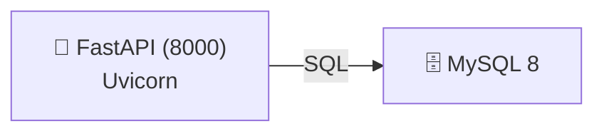

# SastreGuilFernandoBD-2026
# Biblioteca REST API

API REST para la gestión de una biblioteca, desarrollada con **FastAPI** y **MySQL**, 
desplegada con **Docker** (Uvicorn en puerto 8000, MySQL en puerto 3306).

## Tecnologías

- Python 3.11
- FastAPI
- MySQL 8.0
- Docker + Docker Compose
- Uvicorn

## Arquitectura



Dos servicios Docker:
| Servicio | Puerto | Descripción |
|----------|--------|-------------|
| `mysql`  | 3306   | Base de datos MySQL 8.0 con persistencia local |
| `python` | 8000   | API FastAPI + Uvicorn |

## Estructura del proyecto
```api/
├── main.py
├── database.py
└── routes/
    ├── base.py
    └── books.py
setup-environment/
├── docker-compose.yml
├── .env.example
├── Dockerfile
└── requirements.txt
data/
└── mysql-data/```
## Instalación y puesta en marcha

1. Clona el repositorio:
   git clone https://github.com/fsg399/SastreGuilFernandoBD-2026.git

2. Renombra el archivo de entorno:
   cp setup-environment/.env.example setup-environment/.env
   (edita los valores de contraseña)

```env
   MYSQL_ROOT_PASSWORD=<your-root-password>
   MYSQL_DATABASE=<your-database-name>
   MYSQL_USER=<your-username>
   MYSQL_PASSWORD=<your-password>
```

3. Arranca los contenedores:
```bash
   cd setup-environment
   docker-compose up --build -d
```

4. Importa la base de datos en MySQL Workbench:
   - biblioteca-schema.sql
   - biblioteca-datos.sql

5. Crea el usuario de base de datos:
```sql
   CREATE USER biblioteca@'%' IDENTIFIED BY 'biblioteca123';
   GRANT ALL PRIVILEGES ON PrestamosBiblioteca.* TO biblioteca@'%';
   FLUSH PRIVILEGES;
```

6. Verifica el estado de los servicios:
```bash
   docker-compose ps
   docker-compose logs -f python   # logs de la API
```

   > **NOTA:** Puedes usar Docker Desktop para gestionar los contenedores y volúmenes de forma visual.
   > El contenedor `python` contiene un servidor Uvicorn en modo de desarrollo, por lo que se reiniciará automáticamente al detectar cambios en el código fuente.

7. La API estará disponible en:

   | Servicio | URL |
   |----------|-----|
   | API | http://localhost:8000 |
   | Documentación Swagger | http://localhost:8000/docs |
   | Documentación ReDoc | http://localhost:8000/redoc |

---

## Endpoints

### Base

| Método | Ruta | Descripción |
|--------|------|-------------|
| GET | `/` | Bienvenida con enlaces HATEOAS |
| GET | `/health` | Health check |
| GET | `/docs` | Documentación Swagger UI |
| GET | `/redoc` | Documentación ReDoc |

---

### 📚 Libros

---

#### GET /books/
Devuelve la lista completa de libros.

**Petición:**
```bash
curl http://localhost:8000/books/
```

**Respuesta (200 OK):**
```json
[
  {
    "id": 1,
    "titulo": "El Quijote",
    "autor": "Miguel de Cervantes",
    "editorial": "Editorial A",
    "publicadoEn": 1605,
    "categoria": "Ficción"
  },
  {
    "id": 2,
    "titulo": "Cien años de soledad",
    "autor": "Gabriel García Márquez",
    "editorial": "Editorial B",
    "publicadoEn": 1967,
    "categoria": "Ficción"
  }
]
```

---

#### GET /books/{id}
Devuelve un libro por su ID.

**Petición:**
```bash
curl http://localhost:8000/books/1
```

**Respuesta (200 OK):**
```json
{
  "id": 1,
  "titulo": "El Quijote",
  "autor": "Miguel de Cervantes",
  "editorial": "Editorial A",
  "publicadoEn": 1605,
  "categoria": "Ficción"
}
```

**Respuesta si no existe (404):**
```json
{ "detail": "Book not found" }
```

---

#### POST /books/
Crea un nuevo libro.

**Petición:**
```bash
curl -X POST http://localhost:8000/books/ \
  -H "Content-Type: application/json" \
  -d '{
    "titulo": "Don Quijote",
    "autor": "Cervantes",
    "editorial": "Espasa",
    "publicadoEn": 1605,
    "categoria": "Ficción"
  }'
```

**Respuesta (201 Created):**
```json
{
  "id": 18,
  "titulo": "Don Quijote",
  "autor": "Cervantes",
  "editorial": "Espasa",
  "publicadoEn": 1605,
  "categoria": "Ficción"
}
```

---

#### PUT /books/{id}
Actualiza un libro existente por su ID.

**Petición:**
```bash
curl -X PUT http://localhost:8000/books/18 \
  -H "Content-Type: application/json" \
  -d '{
    "titulo": "Don Quijote de la Mancha",
    "autor": "Miguel de Cervantes",
    "editorial": "Espasa Calpe",
    "publicadoEn": 1605,
    "categoria": "Ficción"
  }'
```

**Respuesta (200 OK):**
```json
{
  "id": 18,
  "titulo": "Don Quijote de la Mancha",
  "autor": "Miguel de Cervantes",
  "editorial": "Espasa Calpe",
  "publicadoEn": 1605,
  "categoria": "Ficción"
}
```

**Respuesta si no existe (404):**
```json
{ "detail": "Book not found" }
```

---

#### DELETE /books/{id}
Elimina un libro por su ID.

**Petición:**
```bash
curl -X DELETE http://localhost:8000/books/18
```

**Respuesta:** 204 No Content (sin cuerpo)

**Respuesta si tiene ejemplares asociados (409):**
```json
{ "detail": "No se puede eliminar: el libro tiene ejemplares o reseñas asociados" }
```

---

### 🔄 Préstamos

---

#### POST /loans/
Crea un nuevo préstamo de un ejemplar.

**Petición:**
```bash
curl -X POST http://localhost:8000/loans/ \
  -H "Content-Type: application/json" \
  -d '{
    "userId": 1,
    "inventoryNumber": "EJ001"
  }'
```

**Respuesta (200 OK):**
```json
{ "message": "Préstamo creado correctamente" }
```

**Respuesta si el ejemplar no está disponible (400):**
```json
{ "detail": "El ejemplar no está disponible" }
```

---

#### POST /loans/return
Registra la devolución de un ejemplar prestado.

**Petición:**
```bash
curl -X POST http://localhost:8000/loans/return \
  -H "Content-Type: application/json" \
  -d '{
    "userId": 1,
    "inventoryNumber": "EJ001"
  }'
```

**Respuesta (200 OK):**
```json
{ "message": "Devolución registrada correctamente" }
```

**Respuesta si no hay préstamo activo (404):**
```json
{ "detail": "No se encontró un préstamo activo para ese ejemplar y usuario" }
```

---

## Comandos útiles

```bash
# Parar servicios
docker-compose down

# Reiniciar solo la API
docker-compose restart python

# Entrar al contenedor de la API
docker exec -it $(docker-compose ps -q python) /bin/sh

# Acceder a MySQL
docker exec -it mysql mysql -u root -p
```

## Dependencias principales

**API** (`requirements.txt`):
- `fastapi` — framework web
- `uvicorn` — servidor ASGI
- `mysql-connector-python` — driver MySQL
- `dotenv` — carga de variables de entorno
- `pydantic` — validación de datos
- `pytz` — manejo de zonas horarias

## Licencia

Este proyecto está licenciado bajo la Licencia CC BY-NC-ND 4.0. Esto significa que puedes compartir el proyecto siempre que cites al autor, no lo uses para fines comerciales y no realices obras derivadas.
